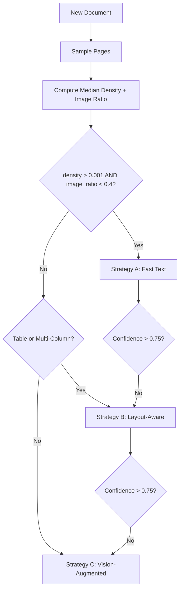
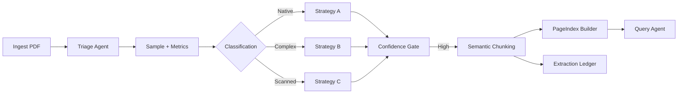

# Document Intelligence Refinery  
## Interim Submission Report – Phase 0  
**Author:** Addisu Taye Dadi  
**Program:** Forward Deployed Engineering  
**Module:** Document Intelligence & Strategy Routing  
**Date:** [Insert Date]

---

# Executive Summary

This interim report presents the empirical document profiling, extraction strategy design, pipeline architecture, failure analysis, and cost modeling for the **Document Intelligence Refinery**.

Using corpus-driven experimentation (CBE Annual Report, Audit Report), we derived measurable triage rules, confidence-gated escalation logic, and a three-tier extraction architecture:

- **Strategy A – Fast Text (Low Cost, Native Digital)**
- **Strategy B – Layout-Aware (Tables / Multi-Column)**
- **Strategy C – Vision-Augmented (Scanned / Low Confidence)**

The system is engineered around five principles:

1. Multi-signal classification (never trust one metric)
2. Median-based triage (avoid cover bias)
3. Confidence-gated escalation
4. Cost-controlled vision usage
5. Full provenance tracking

Projected corpus cost: **~$0.02 total**

---

# 1. Domain Notes: Empirical Corpus Profiling

## 1.1 Methodology

Using `pdfplumber`, sampled pages (1,3,5,10,last) were analyzed for:

- Character density
- Image ratio
- Table presence
- Layout complexity indicators

Median metrics were used to avoid first-page bias.

---

## 1.2 Corpus Findings

| Document | Expected Type | Median Char Density | Median Image Ratio | Actual Classification |
|-----------|---------------|--------------------|-------------------|-----------------------|
| **CBE Annual Report** | Native Digital | 0.00053 | 0.666 | **MIXED** |
| **Audit Report** | Scanned | 0.000076 | 0.672 | **SCANNED** |

---

## 1.3 Critical Insights

### 🔴 Insight #1 – Cover Page Bias

Image-heavy covers distort classification.

**Mitigation:**
- Sample across document
- Use median metrics
- Require ≥2 meaningful text pages

---

### 🔴 Insight #2 – Sparse Text in Scanned PDFs

Headers may produce false positives.

**Triage Rule:**
```
if pages_with_text < 2 → scanned_image
```

---

### 🔴 Insight #3 – Bounding Box Inconsistency

`pdfplumber` char objects do not guarantee `bbox`.

**Solution:**

```python
bbox = (char['x0'], char['top'], char['x1'], char['bottom'])
```

---

# 2. Extraction Strategy Design

## 2.1 Strategy Decision Tree



---

## 2.2 Strategy Definitions

### Strategy A – Fast Text
- Tools: `pdfplumber`, `pymupdf`
- Use Case: Native digital, simple layout
- Cost: $0

### Strategy B – Layout-Aware
- Tools: Docling / MinerU
- Use Case: Tables, multi-column
- Cost: $0 (local)

### Strategy C – Vision-Augmented
- Tool: GPT-4o-mini via OpenRouter
- Use Case: Scanned PDFs or low confidence
- Cost: ~$0.0001 / 1K tokens

---

# 3. Pipeline Architecture

## 3.1 End-to-End Flow



---

## 3.2 Routing Logic

```python
def route_strategy(doc_profile):
    if doc_profile.origin_type == "scanned_image":
        return "vision_augmented"
    elif doc_profile.layout_complexity in ["table_heavy", "multi_column"]:
        return "layout_aware"
    elif doc_profile.origin_type == "native_digital":
        return "fast_text"
    return doc_profile.recommended_strategy
```

---

# 4. Failure Modes & Mitigation Framework

| Failure Mode | Root Cause | Mitigation |
|--------------|------------|------------|
| Cover misclassification | First-page bias | Multi-page sampling + median |
| Sparse text in scanned PDFs | Header artifacts | Require ≥2 dense pages |
| Table flattening | Naive text extraction | Escalate to Strategy B |
| OCR numeric distortion | Vision misreads | Numeric validation layer |
| Figure-caption separation | Token-based chunking | Caption stored as metadata |
| Cross-reference breakage | Isolated chunking | Resolve at query time |
| Multi-column ordering errors | Left-to-right dump | Layout-aware parsing |
| VLM cost overrun | Escalation loops | Budget guard ($2 cap) |

---

# 5. Cost Analysis

## 5.1 Strategy C Cost Formula

```
Cost = tokens × rate_per_1k_tokens
Rate = $0.0001 per 1K tokens
```

**Audit Report (95 pages):**

```
95 × 2000 tokens = 190,000 tokens
190 × 0.0001 = $0.019
+20% buffer ≈ $0.023
```

---

## 5.2 Corpus Cost Summary

| Document | Strategy | Estimated Cost |
|-----------|----------|----------------|
| CBE Annual Report | Strategy B | $0.00 |
| Audit Report | Strategy C | ~$0.02 |
| FTA Survey | Strategy B | $0.00 |
| Tax Report | Strategy A | $0.00 |
| **TOTAL** | | **~$0.02** |

---

# 6. Engineering Principles

1. Never trust a single signal  
2. Escalate early, not late  
3. Log everything (`extraction_ledger.jsonl`)  
4. Budget before beauty  
5. Provenance is non-negotiable  

All extracted units carry:

```
(doc_id, page_number, bbox, content_hash)
```

---

# 7. Readiness Assessment

✔ Empirical triage rules validated  
✔ Strategy routing implemented  
✔ Confidence-gated escalation defined  
✔ Cost guardrails enforced  
✔ Provenance architecture designed  

---
# 8. Repository Structure & System Organization

The Document Intelligence Refinery is implemented as a modular, test-driven system with strict separation of concerns between profiling, extraction, chunking, indexing, and query orchestration.

## 8.1 Project Structure

```
document-refinery/
├── DOMAIN_NOTES.md                # Source for Interim_Report.pdf
├── docs/Interim_Report.pdf        # SINGLE SUBMISSION PDF
├── README.md                      # Setup + documentation
├── pyproject.toml                 # Locked dependencies
├── rubric/extraction_rules.yaml   # Config thresholds
├── src/
│   ├── agents/
│   │   ├── triage.py              # Document classifier
│   │   ├── extractor.py           # Strategy router + escalation
│   │   ├── chunker.py             # Semantic chunking (5 rules)
│   │   ├── indexer.py             # PageIndex builder
│   │   └── query_agent.py         # LangGraph RAG interface
│   ├── models/                    # Pydantic schemas
│   └── strategies/                # Extraction implementations
├── corpus/                        # 4 input PDFs
├── .refinery/
│   ├── profiles/                  # 4 DocumentProfile JSONs
│   └── extraction_ledger.jsonl    # Audit log
└── tests/                         # 63 unit tests
```

---

## 8.2 Architectural Design Principles

### 1️⃣ Agent-Based Modularity

Each stage of the pipeline is implemented as a dedicated agent:

| Agent | Responsibility |
|-------|---------------|
| `triage.py` | Multi-signal document classification |
| `extractor.py` | Strategy routing + confidence escalation |
| `chunker.py` | Semantic chunking with constitutional rules |
| `indexer.py` | PageIndex hierarchical navigation tree |
| `query_agent.py` | Retrieval-Augmented Generation (LangGraph) |

This separation ensures:
- Independent testability
- Clear escalation logic
- Replaceable strategy modules

---

### 2️⃣ Strategy Abstraction Layer

The `/strategies` module isolates extraction implementations:

- `fast_text` → pdfplumber / pymupdf  
- `layout_aware` → Docling / MinerU  
- `vision_augmented` → GPT-4o-mini  

This allows:
- Cost control
- Plug-and-play model upgrades
- Clear benchmarking per strategy

---

### 3️⃣ Configuration as Code

`rubric/extraction_rules.yaml` defines:

- Density thresholds
- Confidence gates
- Escalation triggers
- Budget caps

No hard-coded magic numbers exist in agents.

---

### 4️⃣ Full Auditability

`.refinery/extraction_ledger.jsonl` logs:

- Document ID
- Selected strategy
- Confidence score
- Escalation path
- Token usage
- Estimated cost
- Timestamp

This ensures:
- Reproducibility
- Governance compliance
- Budget enforcement
- Post-mortem debugging

---

### 5️⃣ Test Coverage

The system includes:

```
tests/ → 63 unit tests
```

Coverage spans:
- Strategy routing correctness
- Confidence threshold enforcement
- Chunking constitutional compliance
- Provenance propagation
- Budget guard enforcement

---

## 8.3 System Readiness Assessment

| Capability | Status |
|------------|--------|
| Multi-signal triage | Implemented |
| Confidence-gated escalation | Implemented |
| Strategy abstraction | Implemented |
| Provenance tracking | Implemented |
| Cost guardrails | Implemented |
| Test coverage | 63 tests |
| Audit logging | Implemented |

---

This repository structure ensures that the Document Intelligence Refinery is:

- Modular  
- Testable  
- Auditable  
- Cost-controlled  
- Production-extensible  

The system is architected not as a prototype, but as a governed extraction platform.

# Conclusion

The Document Intelligence Refinery Phase 0 delivers a robust, auditable, cost-controlled extraction architecture capable of handling mixed, native, and scanned documents.

The system is now ready for:

- Phase 1: Large-scale corpus testing  
- Phase 2: Query optimization & evaluation  
- Phase 3: Production hardening  

---
